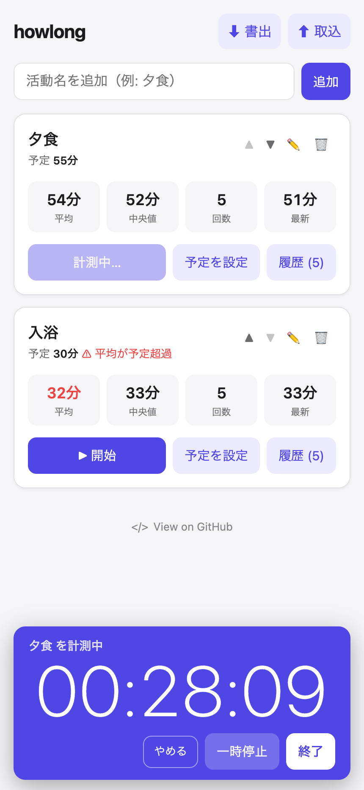
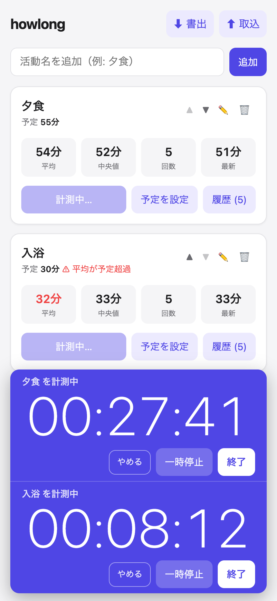

# howlong

**App: https://shifumin.github.io/howlong/**

A personal time-tracking PWA for everyday activities. Record the start/end of an
activity (bath, dinner, …) with one tap, see the average / median time at a glance,
and set a planned time to aim for.

<p align="center">
  
  <br>
  <em>Record how long everyday activities take — see the average &amp; median at a glance.<br>
  Left: one activity being timed. Right: two at once, each timer with its own row.</em>
</p>

No server. The app is a single `index.html` (inline CSS) plus one script
(`app.js`) that stores everything in the browser's `localStorage` on your device.

**The interface is in Japanese.** The feature names below are English descriptions;
the buttons themselves read 開始 (start), 一時停止 (pause), 再開 (resume),
やめる (cancel) and 終了 (stop).

## Features

- **Activities** — add an activity once, reuse it from then on
- **Reorder, rename & delete** — move activities up/down with ▲▼ buttons (works on
  iPhone touch), rename or delete them; the display order is saved
- **Start / Stop timer** — a live `HH:MM:SS` timer in a banner pinned to the bottom
  of the screen, scaled to fill the row width so it stays readable from across the
  room; closing the tab does not reset it (the start time is kept in `localStorage`
  so measurement continues)
- **Several timers at once** — time as many activities in parallel as you like
  (dinner while the bath is running); each one gets its own row in the banner with
  its own pause / discard / stop buttons. One timer per activity
- **Pause / Resume** — pause a running timer and resume it later; time spent paused
  is excluded from the recorded duration, and the paused state survives closing the
  tab. A paused row is dimmed, so it stands out among running ones
- **Cancel** — discard a running measurement without recording it; the button turns
  into a red **破棄？** that needs a second tap to confirm, so a mis-tap costs nothing
- **Statistics** — per activity: average, median, count, and latest, computed automatically
- **Planned time** — set a planned duration per activity; when the average exceeds it,
  the value is highlighted in red (no notifications)
- **History** — a tidy, stats-first view by default; expand to see every record, and
  edit / delete / manually add records (for missed or mistaken taps)
- **JSON export / import** — back up all data as a dated JSON file
  (`howlong-YYYYMMDD.json`). Importing is a **restore, not a merge**: it replaces
  every activity and record currently stored, and stops any running timer. It asks
  for confirmation before doing so

All time values are in **minutes**, rounded to the nearest minute with a
**1-minute minimum** — stopping a timer after 20 seconds records 1 minute, not 0.

## Tech

- PWA: `index.html` (inline CSS) + `app.js` (compiled from `app.ts`)
- Language: **TypeScript** (`strict` mode), compiled with `tsc` — no bundler, no runtime dependencies
- Storage: `localStorage` (device-local; data is never sent anywhere)
- `manifest.json` + `sw.js` (Service Worker: network-first `index.html` + `app.js`, cache-first shell) for "Add to Home Screen" and offline launch
- CI/CD: GitHub Actions builds and deploys to GitHub Pages (`.github/workflows/deploy.yml`)

## Development

Requires Node.js (see `.github/workflows/deploy.yml` for the version CI builds on).

```bash
npm install        # install TypeScript (dev dependency)
npm run build      # compile app.ts -> app.js once
npm run watch      # recompile automatically on every save
```

Then open `index.html` (e.g. via a local server) to try it. `app.js` is
git-ignored — you only ever commit `app.ts`; the build happens in CI.

## Data model

This is what **export** writes and **import** accepts:

```json
{
  "activities": [
    {
      "id": "a...",
      "name": "夕食",
      "plannedMinutes": 20,
      "records": [
        { "start": "2026-05-31T22:00", "end": "2026-05-31T22:22", "minutes": 22 }
      ]
    }
  ]
}
```

The order of the `activities` array is the display order (the ▲▼ buttons reorder
the array; there is no separate order field).

`localStorage` keeps the same object plus a `runnings` array — one entry per
measurement in progress: `activityId`, `firstStart` (when the timer was first
started), `start` (when the current segment started), `accumulatedMs` (time
already run) and `paused`. That is what lets running — or paused — timers
survive closing the tab. It is not part of the export.

Records data stays in `localStorage` on the device only. iOS may rarely clear
`localStorage`, so **JSON export is the backup mechanism**.

## Usage on iPhone

1. Open https://shifumin.github.io/howlong/ in Safari
2. Share → **Add to Home Screen**
3. Launch from the home-screen icon — it runs full-screen like a native app
